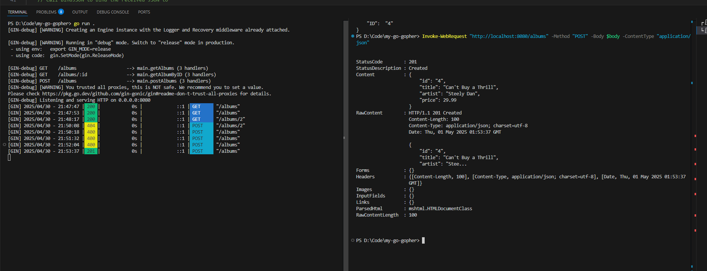
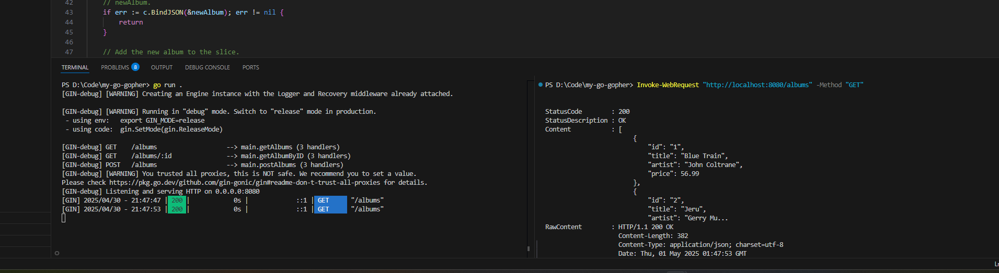
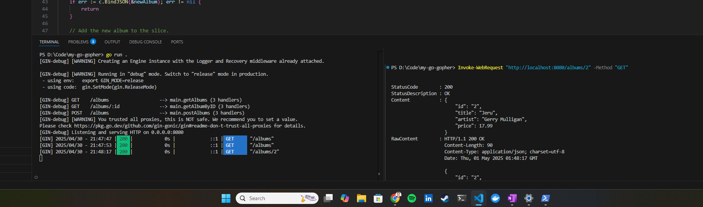

# Go Test App

A simple Go application to demonstrate GitOps CI/CD workflows using GitHub Actions and Kubernetes on Google Kubernetes Engine (GKE).

## Features

- Written in Go
- GitHub Actions for CI/CD
- Dockerized for Kubernetes
- Argo CD-compatible `Application` manifests

## Project Structure

```bash
.
├── .github/workflows     # GitHub Actions CI/CD pipelines
├── k8s/                  # Kubernetes manifests
├── main.go               # Application entry point
├── Dockerfile            # Container build file
├── live-demo             # Screenshots of functing code
└── README.md
```

## Prerequisites

- Docker
- Go 1.20+
- Gin
- kubectl
- Access to a GKE cluster (configured via Terraform in [my-go-gopher-terraform](https://github.com/esketch545/my-go-gopher-terraform))

## CI/CD Overview

- **CI**: Docker builds, kubectl setup and gke plugins triggered on push
- **CD**: Declarative Kubernetes manifests deployed via GitHub Actions to create deployments to GKE cluster

## Local Development

```bash
go mod tidy
go run .
go build
```

## [Docker Image](https://hub.docker.com/repository/docker/esketch545/my-go-gopher/general)

## Live Demo




## License

MIT © Evan Sketch